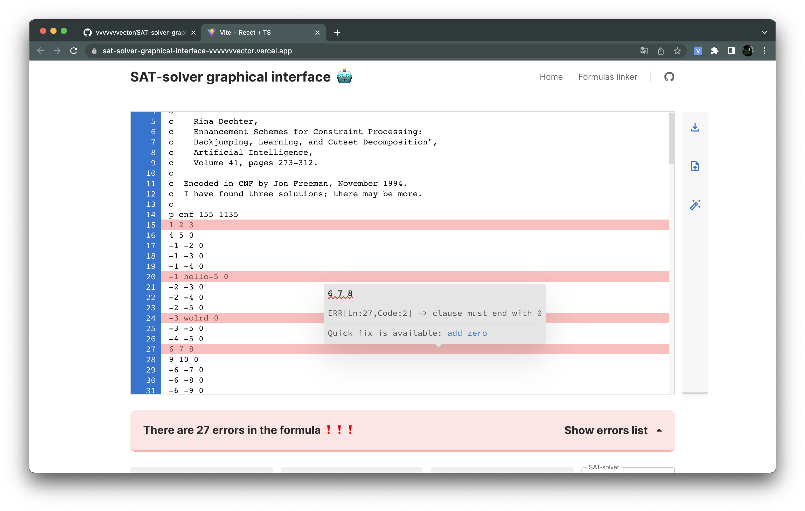

# SAT-solver graphical interface

An open source application built using [React](https://react.dev/).

## About this project

I designed and implemented a helpful application for the Institute of Computer Science at my university. SAT-solver is a program that aims to solve the Boolean satisfiability problem. The SAT-solver graphical interface allows users to work with formulas in the DIMACS CNF format or CNF conveniently, as well as to find and display satisfiable assignments.

If you aren't familiar with the DIMACS CNF format, here are the **formulas examples** that I used to test the app: [examples](./public/formulas-examples/)

## Screenshots



## Running locally

1. Install dependencies using npm:

```sh
npm i
```

2. Start the development server:

```sh
npm run dev
```
