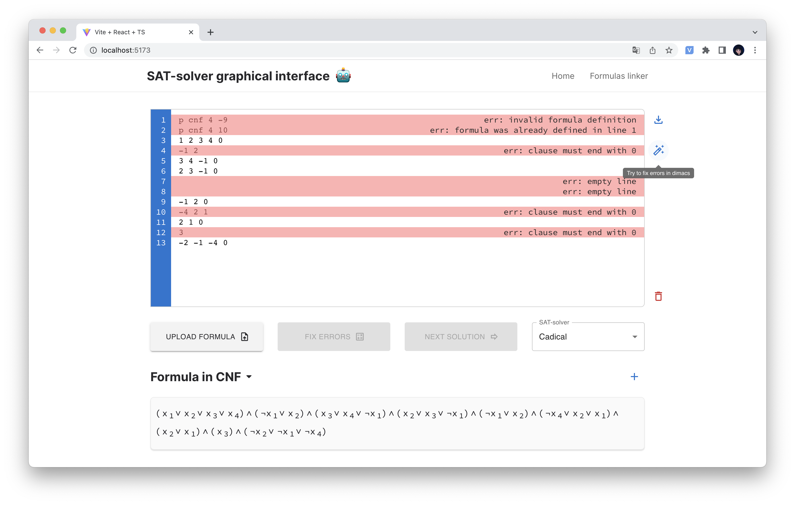
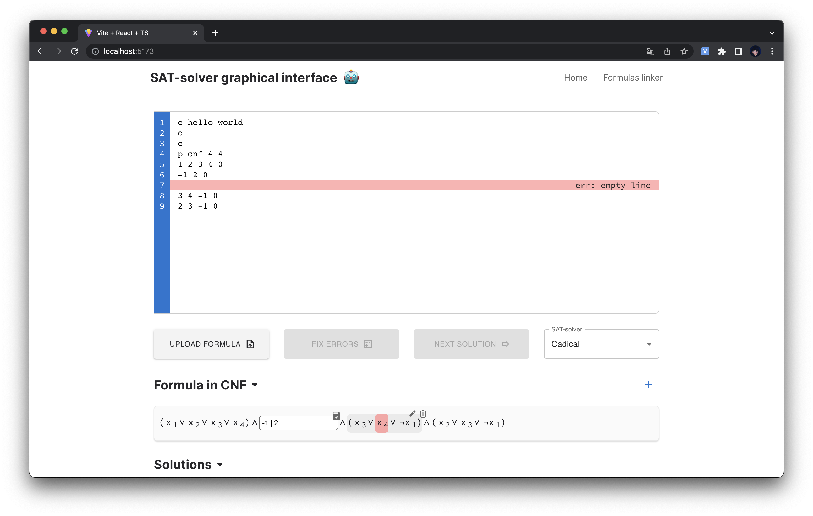
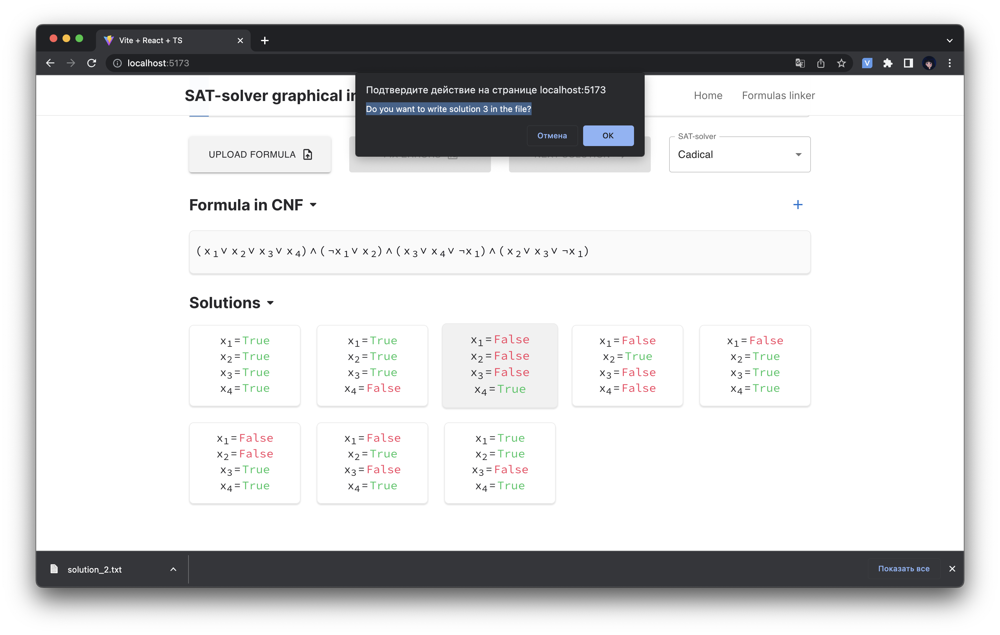
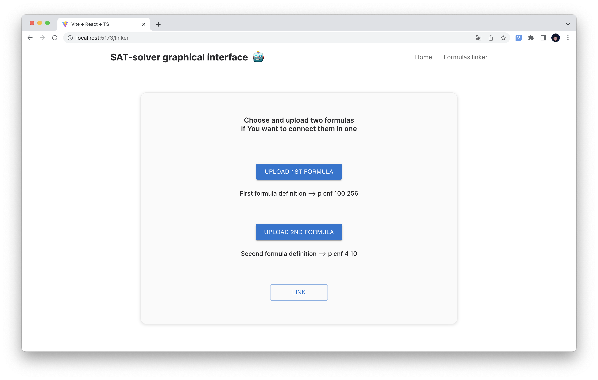

# How to uruchomić frontend

## 1. Zainstalować Node.js

***https://nodejs.org/en/ -> LTS***

## 2. Wejść do katalogu projektu i...

napisać w konsoli: **_npm i_** -> zainstalują się wszystkie potrzebne do projektu pakiety

po instalacji ma pojawić się katalog **_node_modules_**

## 3. Uruchomić program kiedy znajdujesz się w katalogu projektu

trzeba napisać w konsoli: **_npm run dev_**

ta komenda uruchomi program na jakimś porcie(domyślnie, chyba na 5173)
